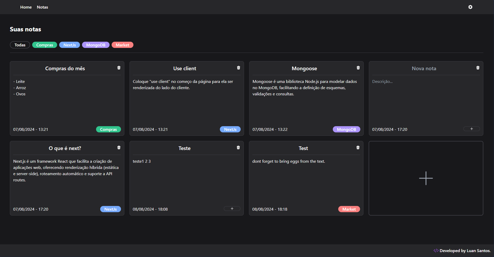

## Sistema de Anotações Dinâmico

Este projeto foi desenvolvido com o objetivo de aprimorar meus conhecimentos em Next.js e aplicar as tecnologias que estou aprendendo. O resultado é um sistema de anotações dinâmico, com uma interface simples, moderna e adaptada para qualquer dispositivo.

### Funcionalidades:

- **Gerenciamento de Notas**: Adicione, remova e edite notas diretamente na interface.
- **Categorias**: Criação de categorias para organizar as notas, que podem ser facilmente filtradas.
- **Dark Mode**: Modo escuro integrado para melhorar a usabilidade em diferentes ambientes de luz.

### Tecnologias Utilizadas:

- **Typescript**: O projeto é totalmente tipado, utilizando interfaces que ajudam na organização do código e na prevenção de erros.
- **TailwindCSS**: O design foi construído com TailwindCSS, proporcionando uma aparência moderna, responsiva e de fácil manutenção. A implementação do modo escuro também foi facilitada com Tailwind.
- **Local Storage**: As notas são armazenadas localmente, garantindo que o projeto seja acessível sem a necessidade de um banco de dados. Inicialmente, o projeto utilizava MongoDB, mas foi alterado para Local Storage para facilitar a adição ao portfólio e permitir o acesso de qualquer pessoa.

### Tecnologias Usadas 

- [Next.js](https://nextjs.org/)
- [Typescript](https://www.typescriptlang.org/)
- [TailwindCSS](https://tailwindcss.com/)
- [Nanoid](https://github.com/ai/nanoid)

### Deploy

Você pode acessar o projeto ao vivo atraves deste link: [Deploy na Vercel](https://notes-app-dusky-chi.vercel.app/)

### Imagens do Projeto

**Tela Principal (Modo Claro)**

**Tela Principal (Modo Escuro)**

